# Сквозное движение клиента по воронке брендов (Customer Journey) — Август 2026

В этом документе описана актуальная архитектура пути клиента от первого касания на онлайн-витрине до подтверждения выдачи дилером, закрытия ДКП в Bitrix24 и начисления очищенной выручки. В схему добавлены **фактические цифры за август 2026 года** строго по **розничным каналам** (сделки по каналам МП1, МП2 и МП3 полностью исключены).

---

## 1. Схема движения клиента с метриками за август 2026 (Mermaid Flowchart)

```mermaid
flowchart TD
    subgraph S1["ЭТАП 1: ОНЛАЙН-ВИТРИНА (PostHog Август 2026)"]
        A["1. Просмотр листинга (page_view)<br>259 301 просмотров каталога"] --> B["2. Показ карточек брендов (car_card_show)<br>311 249 показов (14 брендов)"]
        B -->|CTR 10.1%| C["3. Клик Оставить заявку (car_card_click)<br>31 507 кликов"]
        C --> D["4. Экран преимуществ (offer_show)<br>30 671 показов модального окна"]
        D -->|CR 60.7%| E["5. Повторный клик Оставить заявку (offer_click)<br>18 606 подтверждений"]
        E -->|CR 97.5%| F["6. Экран успеха (offer_success)<br>18 135 успешных заявок онлайн"]
    end

    subgraph S2["ЭТАП 2: CRM BACKOFFICE — ПЕРВАЯ ЛИНИЯ И КВАЛИФИКАЦИЯ"]
        F --> G["Создание нового Лида в CRM<br>10 385 лидов за август (статус Новый лид)"]
        G --> H["Звонок 1-й линии (Контакт-центр)<br>Проверка потребности в авто"]
        H --> I{"Квалификация 1-й линией"}
        I -->|"Нецелевой (57.9%)"| J["Архив / Нецелевой<br>6 013 лидов (спам/отказ)"]
        I -->|"Целевой = 1 (42.1%)"| K["Квалифицированный лид<br>4 372 лида передано на 2-ю линию"]
    end

    subgraph S3["ЭТАП 3: МЕНЕДЖЕР 2-Й ЛИНИИ И РАЗВИЛКА КАНАЛОВ (ТОЛЬКО РОЗНИЦА)"]
        K --> L{"Интервью менеджера 2-й линии"}
        
        %% Ветка 1
        L -->|Сценарий 1: Напрямую в салон| M["ВЕТКА 1: Передача лида в ДЦ<br>906 передач партнерам (без кредита/предоплаты)"]
        M --> N["Клиенты в дилерских центрах<br>(Major, Авторитэйл, БЦР и др.)"]
        
        %% Ветка 2
        L -->|Сценарий 2: Кредит Сбера| O["ВЕТКА 2: Кредитный трек ФДЦ"]
        O --> P["Расчет в калькуляторе (calc_total)<br>4 986 расчетов менеджерами"]
        P -.->|Опционально| Q["Отправка оффера клиенту<br>3 689 офферов"]
        P --> R["Подача заявки на кредит в ФДЦ<br>1 123 заявки в Сбербанк"]
        Q --> R
        R --> S{"Скоринг ФДЦ"}
        
        %% Развилка из Отказа ФДЦ
        S -->|"Отказ банка (~49%)"| S_NO["Отказ ФДЦ: тупик<br>клиент отказался"]
        S -->|"Отказ банка: вариант 2"| M_REDIRECT["Передача лида в ДЦ<br>(Сделка по передаче лида)"]
        M_REDIRECT --> N
        
        %% Развилка из Одобрения ФДЦ
        S -->|"Одобрено: 568 заявок (50.6%)"| T["Одобренная кредитная заявка"]
        T -->|Вариант 1| U["Внесение предоплаты (бронь авто)"]
        T -->|Вариант 2| T_DC["Передача лида в ДЦ<br>(Сделка по передаче лида)"]
        T_DC --> N
        T -->|Вариант 3| T_DROP["Отказ / Тупик"]
        
        %% Ветка 3
        L -->|Сценарий 3: Без кредита| V["ВЕТКА 3: Предоплата без кредита<br>Прямая бронь / аванс 5 000 ₽"]
    end

    subgraph S4["ЭТАП 4: СДЕЛКА И ВЫРУЧКА В АВГУСТЕ (РОЗНИЦА, БЕЗ МП1/МП2/МП3)"]
        N --> W["Подтверждение по сделке от дилера:<br>104 сделки по переданным лидам<br>Выручка: 3 633 851.58 ₽"]
        U --> X["Подтверждение по сделке от дилера:<br>143 сделки по кредитам ФДЦ<br>Выручка: 5 890 627.59 ₽"]
        V --> Y["Подтверждение по сделке от дилера:<br>96 прямых сделок по предоплате<br>Выручка: 4 014 488.14 ₽"]
        
        W --> Z["Фиксация и закрытие в Bitrix24<br>ИТОГО РОЗНИЦА (без МП1/МП2/МП3):<br>343 сделки | Выручка: 13 538 967.31 ₽"]
        X --> Z
        Y --> Z
        
        Z --> AA["Статус сделки: Успешно"]
        AA --> AB["Очищенная выручка СберАвто (комиссия / 1.22)<br>Исключены оптовые каналы МП2 (1331 шт), МП3 (41 шт), МП1 (11 шт)"]
    end

    classDef vitrina fill:#e0f2fe,stroke:#0284c7,stroke-width:2px;
    classDef crm fill:#fef3c7,stroke:#d97706,stroke-width:2px;
    classDef branch fill:#ecfdf5,stroke:#059669,stroke-width:2px;
    classDef deal fill:#f0fdf4,stroke:#16a34a,stroke-width:3px;
    classDef drop fill:#fee2e2,stroke:#dc2626,stroke-width:1px;

    class A,B,C,D,E,F vitrina;
    class G,H,I,K crm;
    class M,N,O,P,Q,R,S,T,U,V,M_REDIRECT,T_DC branch;
    class W,X,Y,Z,AA,AB deal;
    class J,S_NO,T_DROP drop;
```

---

## 2. Фактические показатели за Август 2026 года

### Этап 1. Онлайн-витрина (PostHog Clickstream — 14 брендов)
* **`page_view` (Каталог авто):** 259 301 просмотр
* **`car_card_show` (Показ карточек брендов):** 311 249 показов
* **`car_card_click` (Клик «Оставить заявку»):** 31 507 кликов ($\text{CTR} = 10.1\%$)
* **`offer_show` (Экран преимуществ):** 30 671 показ
* **`offer_click` (Повторный клик «Оставить заявку»):** 18 606 подтверждений ($\text{CR} = 60.7\%$)
* **`offer_success` (Экран успеха):** 18 135 успешных заявок онлайн ($\text{CR} = 97.5\%$)

### Этап 2. CRM Backoffice — 1-я линия и квалификация
* **Лиды в CRM (статус «Новый лид»):** 10 385 лидов
* **Квалифицированные лиды (`Целевой = 1`):** 4 372 лида ($\text{CR} = 42.1\%$)
* **Нецелевые / архив (`Целевой = 0`):** 6 013 лидов (57.9%)

### Этап 3. Менеджер 2-й линии и сценарии продаж
* **Ветка 1 (Передача лида в ДЦ):** 906 передач дилерам-партнерам
* **Ветка 2 (Кредитный трек ФДЦ):**
  * Расчеты в калькуляторе менеджерами (`calc_total`): 4 986
  * Отправка оффера клиенту: 3 689
  * Заявки на кредит ФДЦ в Сбербанк: 1 123
  * Одобрения банка: 568 заявок ($\text{CR} = 50.6\%$)
* **Ветка 3 (Предоплата без кредита):** Прямая бронь за наличные / аванс

### Этап 4. Сделки и Выручка в Августе 2026 (ТОЛЬКО РОЗНИЦА)
По подтверждениям от дилеров закрыто в Bitrix24:
1. **Сделки по переданным лидам:** 104 сделки, выручка **3 633 851.58 ₽**
2. **Сделки по кредитам ФДЦ:** 143 сделки, выручка **5 890 627.59 ₽**
3. **Сделки по предоплатам / Online:** 96 сделок, выручка **4 014 488.14 ₽**
4. **ИТОГО РОЗНИЦА по брендам (без МП1, МП2, МП3):**
   * **343 сделки**
   * **13 538 967.31 ₽** очищенной выручки (агентская комиссия очищена от НДС 20% $/ 1.22$)

*(Справочно: оптовые и дистрибьюторские каналы МП2 — 1331 сделка на 49.79 млн ₽, МП3 — 41 сделка на 1.39 млн ₽ и МП1 — 11 сделок на 0.43 млн ₽ полностью исключены).*
